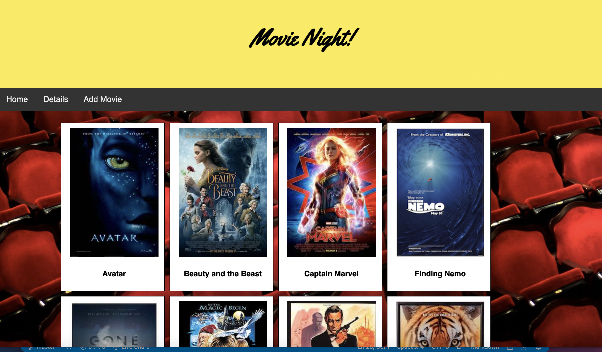
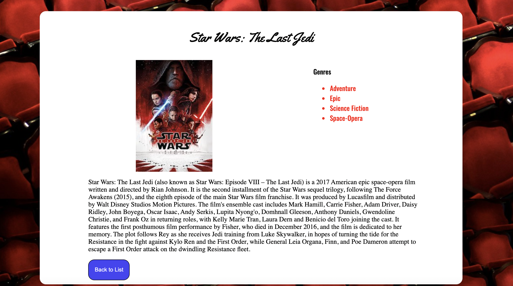
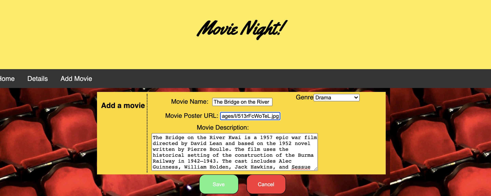

# Movie Sagas

## Description 

This application displays a series of movie posters on the front page of the application. The user can click on the movie posters and get a description and list of genres the selected movie belongs to. From the navigation bar at the top of the page, the user can also choose to add a movie into the database by entering a title, image URL location for the film's movie poster and a description of the movie. 

### Technical description 

The application has information about the movies and the genres they belong to stored in a database. The movie posters are rendered based on information retrieved from this database The movie information is held in the Redux state of the application and combined with a retireve of genre information from the databse in order to render everyhting on the details page. The "Add Movie" page holds the information the user inputs into the fields on this page in the Redux State until the user submits or cancels the form submit process. When the form is submitted, the values held in Redux state are posted to the database tables holding the relevant information. Choosing either cancel or submit clears the values inputed on this page in the Redux state. 

## Screen Shots

## Installation

### Prerequisites:

- Node
- React
- Redux
- Postgres

### Install instructions:

1. From the command line, navigate the root directory
2. Run 'npm install'
3. Create a postGreSQL database using the instructions in the data.sql file
4. From the command line, run 'npm run server'
5. From a second command line, run 'npm run client'

## Built With

- HTML
- CSS
- Javascript
- Node
- Express
- PostGreSQL
- React
- Redux
- Redux Sagas

## License

[MIT]()

## Acknowledgment

Thanks to [Prime Digital Academy](www.primeacademy.io) who equipped and helped me to make this application a reality. 

Special thanks to my learnign group for this week from my Vatti Cohort:

- [James Posey](https://github.com/jposeyjr)
- [Jordan Newberry](https://github.com/jordanNewberry21)

Extra weekend study time thanks to the following;  
- [Josie Fredericksen](https://github.com/freder48)
- [Kimberly Orchard](https://github.com/korchard)

And last but never least, my Prime primary instructor:
- [Mary Mosman](https://github.com/mbMosman)